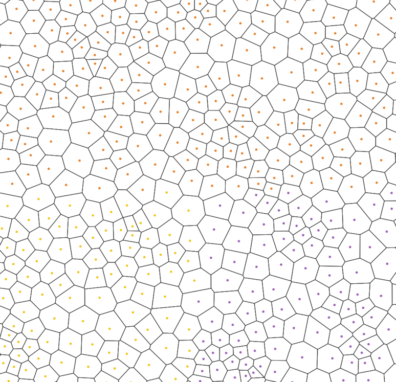

# world-sim
Simulation of a procedurally generated world, using a seemingly-infinite Voronoi diagram as the basis for the world cells. Cells are streamed in real time to clients in chunks.

> A seemingly-infinite Voronoi diagram made up of 4 neighboring chunks of 20 cells each. If you can't tell these are 4 different chunks, that's the point! The chunks seamlessly connect to each other giving the illusion of an infinite Voronoi diagram. The only giveaway is that the chunk centers are indicated with distinct colors.
